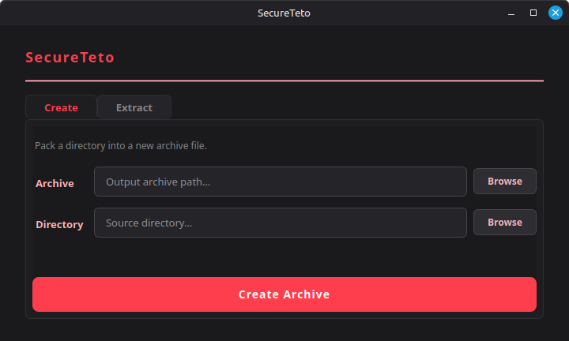

# SecureTeto
> Kasane Teto's encrypted file storage solution for storing her precious baguette images.

**SecureTeto** is a fast, secure, and user-friendly encrypted file storage program written with C (for backend, archiving etc.) and Python (for GUI, PyQt6).

It allows users to create encrypted containers (vaults) that can be accessed securely from Python GUI, providing seamless access to encrypted files.

## ⚠️ Development Status

**SecureTeto** is in **early development**. Currently working on:
- GUI design and implementation
- Adding more features to the C backend for vault management, enc/dec and binding to Python.

Not ready for production use yet!

## Early screenshots of the Python GUI (subject to change):

## Roadmap

- [x] Design unique archive format for encrypted vaults
- [ ] Implement archive creation and extraction
- [ ] Command-line interface (CLI) for vault management

### In future releases...

- [ ] Cross-platform support (Windows, macOS, Linux)
- [ ] Mountable encrypted vaults as virtual drives

## License

This project is licensed under the MIT License - see the [LICENSE](LICENSE) file for details.

Steal the code (responsibly) and use it in your projects or print it with printer and burn them (don't do that), but please give credit to the original author. And don't steal Teto's baguette, that's her!
