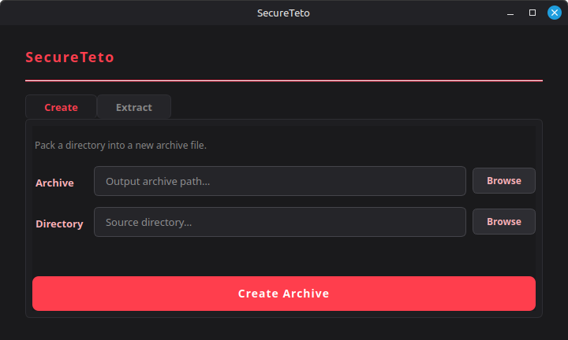

# SecureTeto
> Kasane Teto's encrypted file storage solution for storing her precious baguette images.

**SecureTeto** is a fast, secure, and user-friendly encrypted file storage program written with C (for backend, archiving etc.) and Python (for GUI, PyQt6).

It allows users to create encrypted containers (vaults) that can be accessed securely from Python GUI, providing seamless access to encrypted files.

## ⚠️ Development Status

**SecureTeto** is in **early development**. Currently working on:
- GUI design and implementation
- Adding more features to the C backend for vault management, enc/dec and binding to Python.

Not ready for production use yet!

## Early screenshots of the Python GUI (subject to change):


## Roadmap

- [x] Design unique archive format for encrypted vaults
- [x] Implement archive creation and extraction
- [x] Command-line interface (CLI) for vault management
- [ ] Develop more Python bindings for C backend
- [ ] Implement GUI features for vault creation, file management, and encryption/decryption

### In future releases...

- [ ] Cross-platform support (Windows, macOS, Linux)
- [ ] Mountable encrypted vaults as virtual drives

## Installation

### On Windows
---

#### Pre-requisites

##### MSYS2

1. Download and install [MSYS](https://mingw-w64.org/doku.php/download/mingw-builds)
2. Search **MSYS2 MINGW64** in the search bar and open
3. Write `pacman -Syu` in the terminal
4. If it closes the terminal or says to close it, close it and open it again
5. Write `pacman -Su` in the terminal
6. Install build deps with `pacman -S mingw-w64-x86_64-toolchain` (select all for installation)
7. Install libsodium with `pacman -S mingw-w64-x86_64-libsodium`
8. Install git with `pacman -S mingw-w64-x86_64-git`

##### Python

Download and install [Python 3.11.9](https://www.python.org/downloads/release/python-3119/) (Add to PATH)

#### Install SecureTeto

1. Clone the repository and navigate to the root directory:
```bash
git clone https://github.com/vortique/SecureTeto.git
cd SecureTeto
```

2. Create a virtual environment and activate it:
```bash
python -m venv venv
.\venv\Script\activate
```

3. Install Python dependencies:
```bash
pip install --upgrade pip
pip install -r requirements.txt
```

4. Open MSYS2 MinGW64 terminal to run `make`:
```bash
make

# make lib-win for creating the libsecu_engine.dll
```

5. Run the program:
```bash
.\bin\secu_engine.exe -h
```

### On Linux
---

#### Pre-requisites

1. Most distributions already have `git` and `python3` — you usually only need to install development tools and libsodium.

##### Ubuntu / Debian / Linux Mint / Pop!_OS

```bash
sudo apt update
sudo apt install -y \
    build-essential \
    python3 \
    python3-pip \
    python3-venv \
    git \
    libsodium-dev \
    pkg-config
```

##### Fedora / RHEL-based

```bash
sudo dnf install -y \
    @development-tools \
    python3 \
    python3-pip \
    python3-devel \
    git \
    libsodium-devel \
    pkgconf-pkg-config
```

##### Arch / Manjaro

```bash
sudo pacman -Syu --needed \
    base-devel \
    python \
    python-pip \
    git \
    libsodium \
    pkgconf
```

##### openSUSE

```bash
sudo zypper install -y \
    patterns-devel-base-devel_basis \
    python311 \
    python311-pip \
    git \
    libsodium-devel \
    pkg-config
```

#### Install SecureTeto

1. Clone the repository and navigate to the root directory:
```bash
git clone https://github.com/vortique/SecureTeto.git
cd SecureTeto
```

2. Create a virtual environment and activate it:
```bash
python3 -m venv venv
source venv/bin/activate
```
(You can later deactivate it with deactivate)

3. Install Python dependencies:
```bash
pip install --upgrade pip
pip install -r requirements.txt
```

4. Build the project:
```bash
make

# make lib-linux for creating the libsecu_engine.so
```

5. Run the program:
```bash
./bin/secu_engine # -h for help
```

**NOTE**: GUI is not available yet.

## License

This project is licensed under the MIT License - see the [LICENSE](LICENSE) file for details.

Steal the code (responsibly) and use it in your projects or print it with printer and burn them (don't do that), but please give credit to the original author. And don't steal Teto's baguette, that's her!
